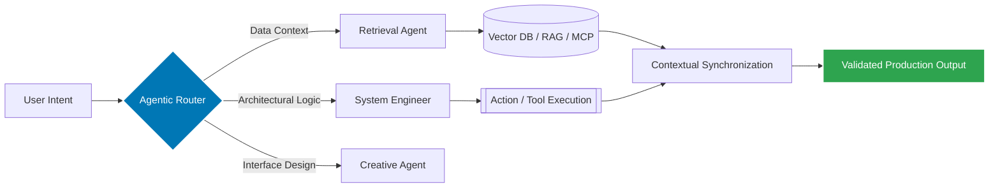

# 🌌 Muhammad Sami
### Senior AI Agent Engineer & Full-Stack Architect

  
  
   

  [🌐 **Live Portfolio**](https://muhammad-sami.vercel.app/) • [📄 **Web Resume**](https://muhammad-sami-resume.vercel.app/) • [📥 **PDF Resume**](public/resume.pdf)
  
   

  
  
  
  
  
  

  

---

## 🛰️ Professional Mission
> *"I do not merely build software; I architect the **Architecture of Intelligence**. My mission is to bridge the gap between sophisticated microservice environments and autonomous agentic layers, enabling systems that reason, plan, and execute with human-like intent."*

---

## 🛠️ Technical Ecosystem

  

 

<table align="center" width="100%">
  <tr>
    <td width="33.33%" valign="top">
      <h3>🧬 Intelligence Layer</h3>
      <ul>
        <li>Autonomous Multi-Agent Orchestration</li>
        <li>Model Context Protocol (MCP)</li>
        <li>Advanced RAG & Vector Search</li>
        <li>OpenAI & Anthropic Specialized SDKs</li>
      </ul>
    </td>
    <td width="33.33%" valign="top">
      <h3>🏛️ Full-Stack Architecture</h3>
      <ul>
        <li>Next.js 15 / React 19 Ecosystem</li>
        <li>Distributed Microservices (Dapr)</li>
        <li>Real-time Event Streaming (Kafka)</li>
        <li>High-Performance Tailwind UI/UX</li>
      </ul>
    </td>
    <td width="33.33%" valign="top">
      <h3>⚡ Automation & Ops</h3>
      <ul>
        <li>Kubernetes & Docker Orchestration</li>
        <li>n8n, Zapier & Make.com Workflows</li>
        <li>Appsmith & Retool Internal Tooling</li>
        <li>CI/CD (GitHub Actions, Argo CD)</li>
      </ul>
    </td>
  </tr>
</table>

---

## 📐 Agentic Workflow Architecture
*Strategic blueprint for Multi-Agent Orchestration and Context Preservation.*

---

## 🏆 National Hackathon Victories
*Recognized as an industry pioneer for architecting award-winning AI systems with record-breaking submission speeds.*

<table width="100%">
  <tr>
    <td width="33.33%" align="center" valign="top">
      <a href="https://muhammad-sami.vercel.app/hackathon/physical-ai-humanoid-robotics-textbook">
        
         
        <b>🥇 Physical AI Humanoid Robotics</b>
      </a>
      
<small><b>1st Place Winner</b>. Pioneering textbooks for Humanoid kinematic control & ROS 2.</small>

    </td>
    <td width="33.33%" align="center" valign="top">
      <a href="https://muhammad-sami.vercel.app/hackathon/cloud-native-ai-todo-platform">
        
         
        <b>🏆 Cloud-Native AI Platform</b>
      </a>
      
<small><b>Winner II</b>. Event-driven Kubernetes architecture with Spec-Driven Development.</small>

    </td>
    <td width="33.33%" align="center" valign="top">
      <a href="https://muhammad-sami.vercel.app/hackathon/learnflow-ai-platform">
        
         
        <b>🎖️ LearnFlow Agentic Tutor</b>
      </a>
      
<small><b>Winner III</b>. 98% Inference efficiency with MCP code execution sandboxing.</small>

    </td>
  </tr>
</table>

---

## 📂 Featured System Showcase

<table width="100%">
  <tr>
    <td width="33.33%" align="center" valign="top">
      <a href="https://github.com/muhammadsami987123/100DaysOfAI-Agents">
        
         
        <b>🤖 100 Days of AI Agents</b>
      </a>
      
<small>550+ autonomous entities engineered for specific industrial automation.</small>

    </td>
    <td width="33.33%" align="center" valign="top">
      <a href="https://hackthone-two.vercel.app/">
        
         
        <b>🧸 Comfort E-Commerce</b>
      </a>
      
<small>High-performance Next.js 15 commerce engine with 0.4s load times.</small>

    </td>
    <td width="33.33%" align="center" valign="top">
      <a href="https://blogwebsite-gray.vercel.app/">
        
         
        <b>✍️ AI Blog Ecosystem</b>
      </a>
      
<small>Modern content hub with automated SEO orchestration & agentic drafting.</small>

    </td>
  </tr>
  <tr>
    <td width="33.33%" align="center" valign="top">
      <a href="https://ecommerceadmindashboard-puce.vercel.app/">
        
         
        <b>🎛️ Neural Admin Panel</b>
      </a>
      
<small>Multi-tenant SaaS dashboard managing real-time inventory & analytics.</small>

    </td>
    <td width="33.33%" align="center" valign="top">
      <a href="https://e-commerce--exclusive.vercel.app/">
        
         
        <b>📊 Electronics Market</b>
      </a>
      
<small>Algorithmic product discovery engine with advanced search logic.</small>

    </td>
    <td width="33.33%" align="center" valign="top">
      <a href="https://muhammad-sami-resume.vercel.app/">
        
         
        <b>💼 Agentic Portfolio V3</b>
      </a>
      
<small>A premium, world-class digital presence showcasing tech depth.</small>

    </td>
  </tr>
</table>

---

## 🧬 Core Engineering Philosophy

### **Model Context Protocol (MCP) Mastery**
In the era of agentic computing, tools are only as good as the context they inhabit. I specialize in building **MCP-native environments** where agents can autonomously build, test, and deploy code within secure, validated sandboxes, reducing "hallucination-to-execution" errors to near zero.

### **Event-Driven Resilience**
Using **Kafka** and **DigitalOcean Kubernetes (DOKS)**, I architect systems that maintain 99.9% availability. My focus is on horizontal scalability—ensuring that decentralized AI agents can handle peak inference loads without compromising core system latency.

---

## ⌚ Professional Timeline

- **Founder & Lead Architect** | `CodePulse Innovations` (2025 – Present)
  - *Launched [FolioGenerator.com](https://foliogenerator.com), an AI-driven platform for rapid portfolio synthesis.*
- **Senior AI Agent Engineer** | `Global Intelligence Solutions` (2024 – Present)
  - *Spearheading MCP-native agentic suites and RAG-driven automation ecosystems.*
- **Frontend Development Intern** | `CodeAlpha` (2025)
  - *Engineered high-performance, responsive UI components for distributed web architectures.*
- **Full Stack Consultant** | `Independent Enterprise Solutions` (2020 – 2023)
  - *Architected 10+ e-commerce engines and neural admin dashboards for diverse clients.*

---

## 📜 Certifications & Education

<table width="100%">
  <tr>
    <td width="50%" valign="top">
      <h3>🎓 Academic Journey</h3>
      <ul>
        <li><b>GIAIC</b>: Certified Cloud GenAI Engineer (2024-2026)</li>
        <li><b>PIAIC</b>: Certified Cloud Agentic-AI Engineer (2024-2026)</li>
        <li><b>Intermediate</b>: Pre-Engineering (2023-2025)</li>
        <li><b>Matriculation</b>: Science Group (2021-2022)</li>
      </ul>
    </td>
    <td width="50%" valign="top">
      <h3>🏅 Key Certifications</h3>
      <ul>
        <li><b>Hackathon Winner III</b>: Agentic Tutoring Systems</li>
        <li><b>Hackathon Winner II</b>: Cloud-Native Infrastructure</li>
        <li><b>Hackathon Winner I</b>: Physical AI Humanoids</li>
        <li><b>Cloud Excellence</b>: Modern Microservices (PIAIC)</li>
      </ul>
    </td>
  </tr>
</table>

---

## 📊 Performance Analytics

  
  

   
  

---

## 📄 License

This project is licensed under the **MIT License** - see the [LICENSE](LICENSE) file for details.

You are free to use, modify, and distribute this software as long as you include the original copyright and license notice in any copies or substantial portions of the software.

---

  
  

    <b>© 2026 | Muhammad Sami</b>  
    <a href="https://muhammad-sami.vercel.app/">Portfolio Core</a> • <a href="https://muhammad-sami-resume.vercel.app/">Web CV</a> • <a href="public/resume.pdf">Engineering PDF</a>
  

